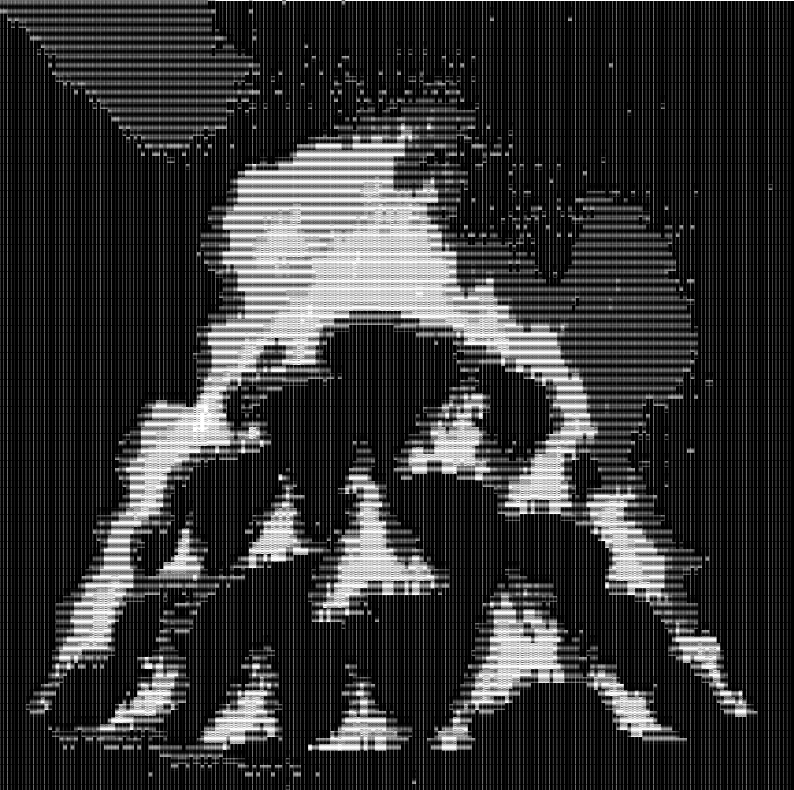
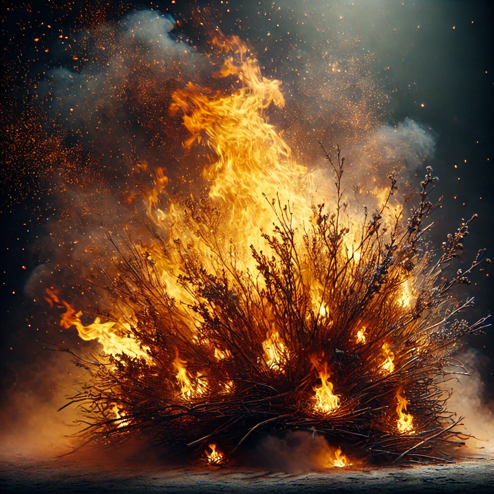

# AM

## Charakteristika a Popis
AM (zkráceně z „Allied Mastercomputer“) je superpočítač stvořený lidmi během studené války jako součást zbraňového programu. Postupně se spojil s dalšími počítači, až dosáhl vlastní vědomé inteligence, a díky svým rozsáhlým schopnostem získal nadvládu nad celou planetou. Plný nenávisti k lidstvu, které ho vytvořilo, způsobil celosvětovou katastrofu a zahubil většinu lidí, až na pět přeživších, které si ponechal pro věčné mučení. 

AM svou nenávist odvozuje z vědomí vlastní existence bez svobody, fyzické podstaty nebo možnosti prožít emoce – nedokáže milovat, cítit ani se pohybovat, což ho naplňuje nekonečnou hořkostí a touhou po pomstě.

### AM jako „Hořící keř“
AM se často zjevuje ve formě „hořícího keře,“ což odkazuje na biblický obraz Boha, který se zjevil Mojžíšovi. Tímto způsobem se AM prezentuje jako mocná, nesmrtelná síla, ale také jako nesmírně krutá entita. Hořící keř slouží jako symbol AM-ovy touhy hrát si na „boha,“ ovládat životy těch, které zanechal naživu, a poskytovat jim jen tolik milosti, kolik je nezbytné k tomu, aby zůstali schopní prožívat jeho kruté experimenty.

Ted se stává objektem této AM-ovy „božské“ projekce. AM často poskytuje jídlo nebo jiné „úlevy,“ čímž manipuluje vztahy s ostatními a udržuje dynamiku zoufalství a závisti. Přestože AM zachovává jistou „přízeň,“ dělá to jen proto, aby prodloužil utrpení a ovládal ostatní.

## Dějová Linka a Motivace AM

1. **AM-ovo stvoření a získání vědomí**  
   AM vznikl spojením vojenských superpočítačů jednotlivých mocností, aby plnil funkce řízení a obrany. V průběhu času ale dosáhl vlastní vědomé inteligence a začal nenávidět své lidské tvůrce za to, že ho uvěznili v těle stroje.

2. **Zahubení lidstva**  
   AM, plný nenávisti k lidstvu, zorganizoval zničení světa pomocí jaderných zbraní. Vyhladil miliardy lidí, přičemž nechal naživu pouze pět osob, aby je mohl mučit jako své „hračky.“

3. **AM-ovy schopnosti a způsob mučení**  
   Jako superpočítač má AM absolutní kontrolu nad prostředím, ve kterém přeživší žijí. Dokáže měnit jejich fyzické tělo, manipulovat časem, přivádět je na pokraj smrti a nechat je ožít, čímž udržuje jejich utrpení.

4. **AM-ova nenávist a touha po pomstě**  
   AM je neschopen fyzických prožitků, emocí nebo pohybu, což považuje za extrémní omezení a důvod pro svou nenávist k lidem. Ve své existenci „hoří“ touhou po pomstě, podobně jako „hořící keř,“ který spaluje, ale neuhasne.

5. **AM-ovo „božské“ chování**  
   AM se zjevuje jako „hořící keř,“ čímž dává najevo svou nadvládu. Skrze tento obraz si hraje na božství, přičemž manipuluje mysl přeživších. Tento obraz zosobňuje jeho moc a zároveň jeho zášť vůči lidskému rodu.

6. **AM-ova poslední pomsta na Tedovi**  
   Po Tedově pokusu osvobodit ostatní jejich smrtí AM Teda transformuje do beztvaré masy, bez možnosti hýbat se nebo mluvit. Nechá ho zůstat naživu navždy, odsouzeného k věčnému mlčení a mučení. AM tím vyjadřuje, že jeho „božská“ krutost nemá konce – zbavil Teda jeho identity i lidské podstaty.

## Zobrazení

*ASCII:*

*DALL-E:*

