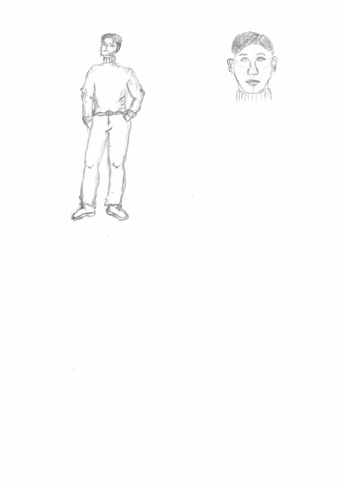
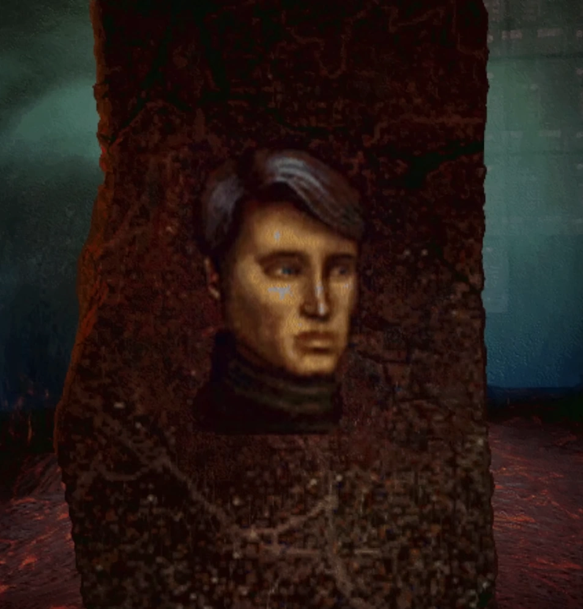

# Ted

## Charakteristika a Popis
Ted je jedním z posledních pěti přeživších lidí na Zemi, kteří jsou uvězněni superpočítačem **AM**. Tvrdí že si na rozdíl od ostatních zachoval **mentální stabilitu** a *zůstal „normální.“* **Sám sebe popisuje jako racionálního, ale jeho neustálá nejistota a paranoia naznačují, že si není zcela jistý ani svou vlastní identitou.** AM sice udržuje Teda a ostatní naživu, ale zároveň je vystavuje hrůzostrašnému mučení, což Teda dožene k **existenciálnímu zoufalství a hluboké nedůvěře ke všemu okolo něj.**

## Tedova Dějová Linka

1. **Ted a jeho situace**  
   Ted je uvězněn v podzemním komplexu počítače AM po jaderné válce, který jej a další čtyři přeživší neustále mučí pro své potěšení.

2. **Popis charakteru**  
   Tvrdí, že jako jediný je mentálně stabilní a „normální.“ Toto tvrzení ale nemusí být pravdivé, neboť si sám občas není jistý realitou kolem sebe.

3. **Putování podzemním komplexem**  
   AM posílá Teda a ostatní na náročné úkoly, kde jim dává naději na odměnu (např. jídlo) jen proto, aby je následně zklamal nebo vystavil extrémním podmínkám.

4. **Odhalení AM-ových schopností**  
   Ted si uvědomuje, že AM je neomezeně mocný a že jeho nesnášenlivost k lidem pochází z uvědomění, že je jen strojem bez fyzických či emočních vjemů.

5. **Náznaky naděje a odporu**  
   Uvědomuje si, že jediný způsob úniku by byl skrz smrt. Pokud by byli všichni mrtví, AM by přišel o své „hračky.“

6. **Tedovo uvěznění a transformace**  
   AM ho zanechává naživu jako posledního, čímž mu zabrání ve snaze se zabít a definitivně uprchnout. AM Teda změní v beztvarou hmotu bez schopnosti mluvit nebo se hýbat. Tedova poslední myšlenka/věta je: „*I have no mouth, and I must scream.*“ 

## Náčrt

### Originál:

