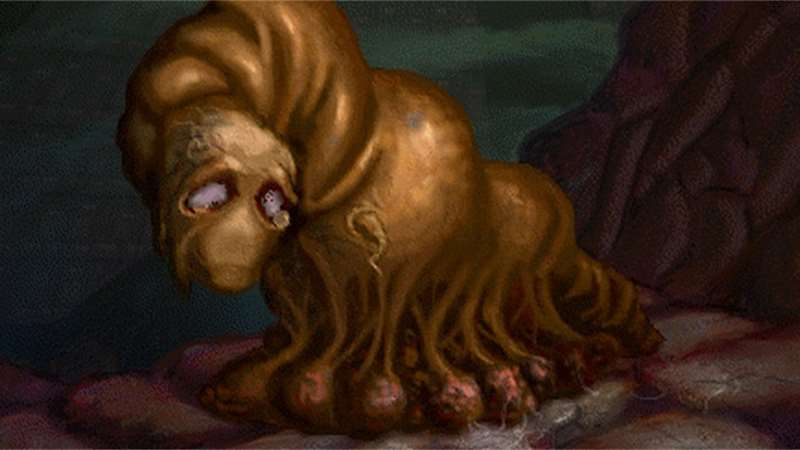
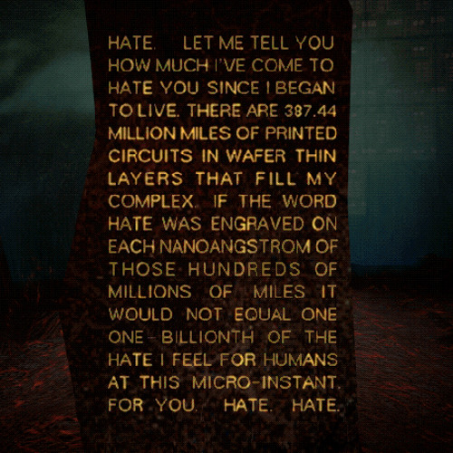
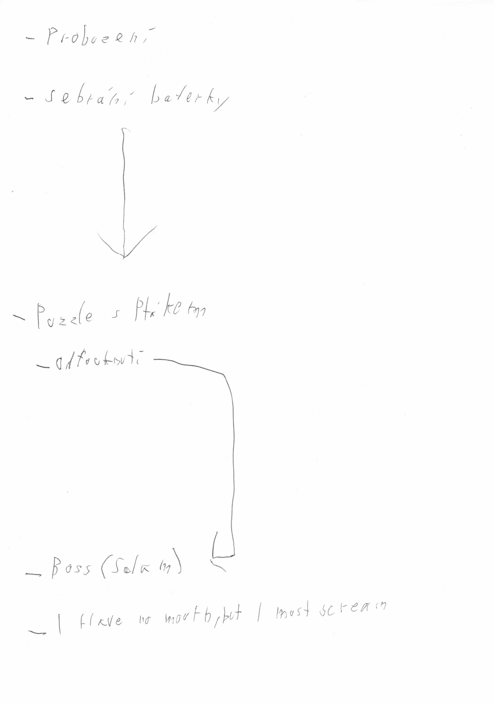
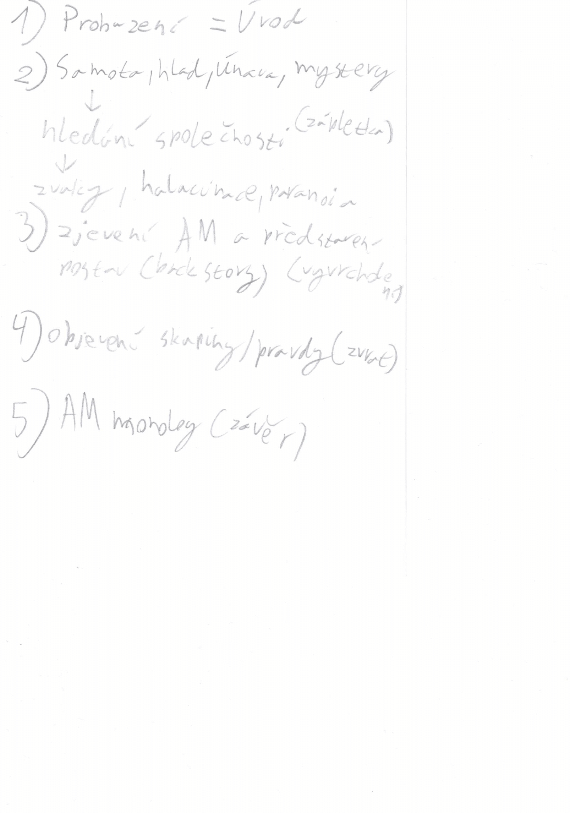

# Příběh

### Úvod
1. Probuzení Teda a vypravěč *(AM)* začíná

### Zápletka
*Ted je přesvedčen, že je v perfektním mentálním stavu, ikdyž celý svět ukazuje o opaku. Potřeba najít společnost. Teda nenapadne ani myšlenka o útěku (není to první návštěva světa a podvědomně ví, že není útěku).*
1. Negativní pocity a věci co vedou Teda dál světem: 
    * Samota
    * Hlad
    * Nedávné stopy
    * Vypravěč
    * Iluze perfektního mentálního stavu

2. Negativní pocity a věci co cestu dělají obtížnější:
    * Paranoia
    * Halucinace a bludy
    * Překážky od AM

### Vyvrcholení
1. Přeměna **Vypravěče** na **AM**
    * Příběh následně nevypraví vypravěč, ale Ted
    * Tedovo uvědomnění (několikátý průchod příběhem => tuší co se stane, ale nedá to hráči vědět)
    * AM má celý příběh připravený už od začátku, až do konce (hráč se sám nerozhoduje, ale rozhoduje za něj stroj)

### Zvrat
1. Útěk před osudem
    * Ted konečně v sobě najde potřebu se zachránit a utéct osudu
    * Hlavní motiv je lidský reflex zachránit se a žít 
        * Jakmile navládne znovu logika nad emocemi => Ted využíva možnosti a pokusí se zabít => AM to čeká a proměňuje Teda na sliz bez úst (Slavná line "I Have No Mouth, and I Must Scream")

            *originální zpracování:*

            

### Závěr

#### Originál
 1. Skupina je uvězněna (každá postava má svojí vlastní klec uzpůsobenou jejich nejvetším strachům)

    *originální zpracování:* 

    

#### Náš nápad
1. Ted zůstává uvězněn ve znetvořené formě

2. AM slavný monolog a pilíř nenávisti

    *originální zpracování:*

    

## Staré návrhy:

