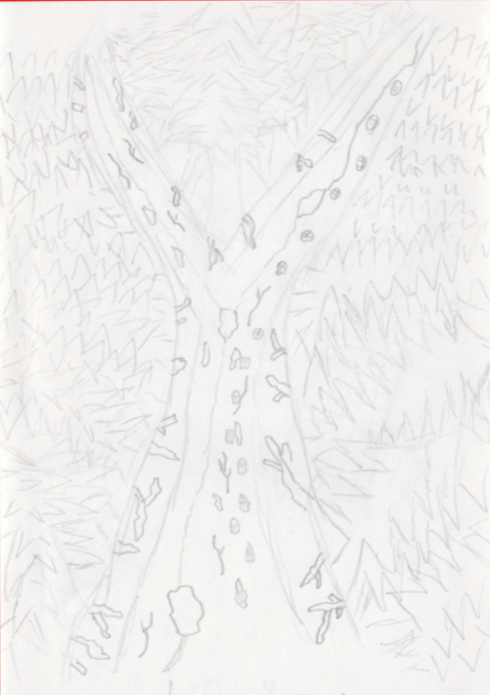
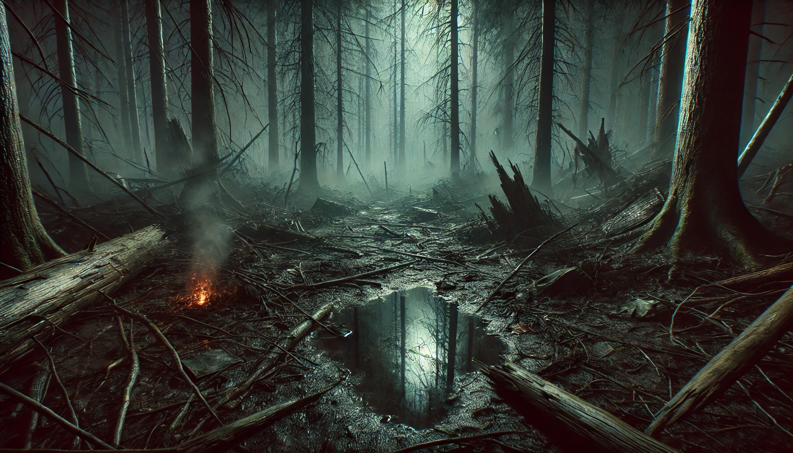
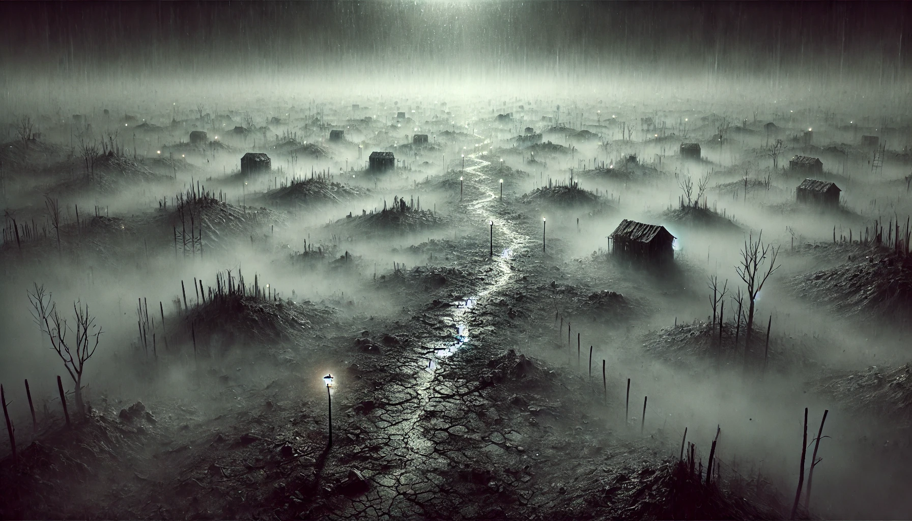
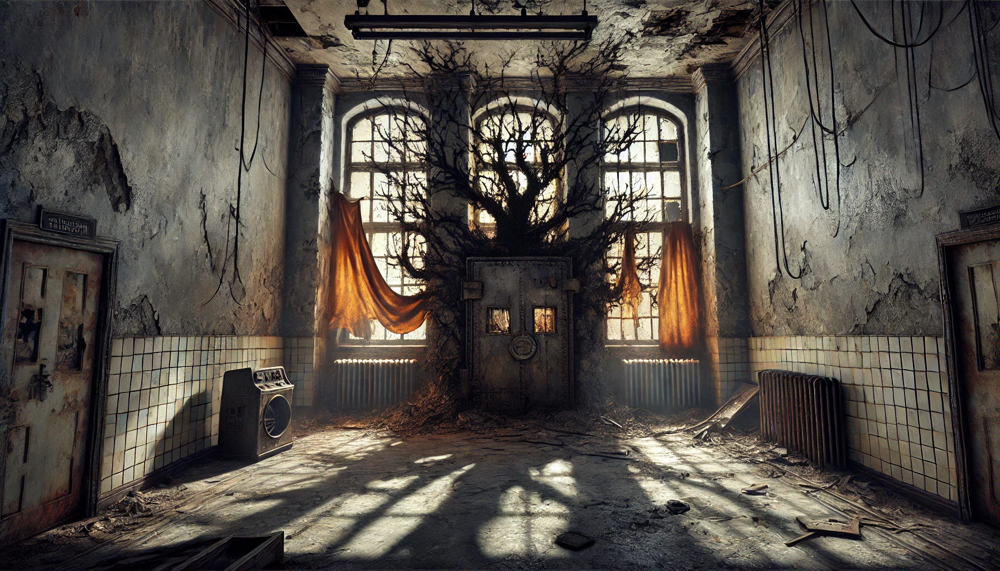
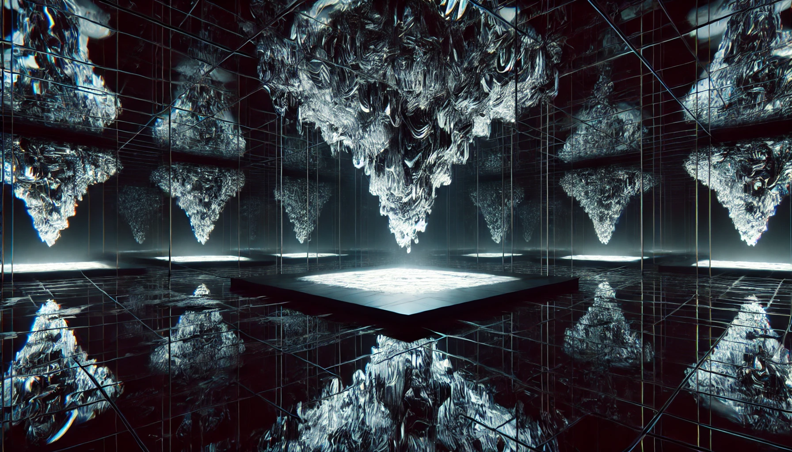
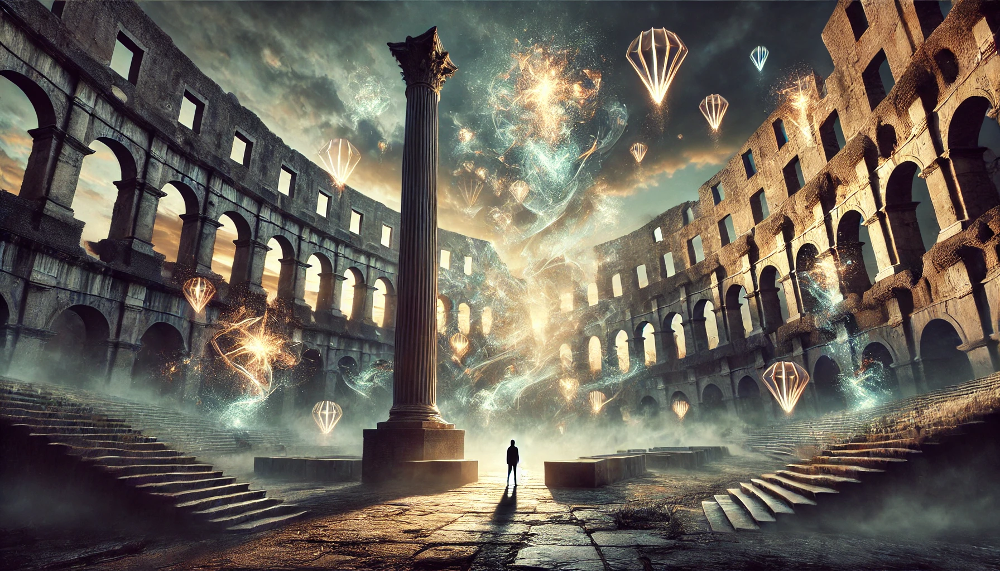
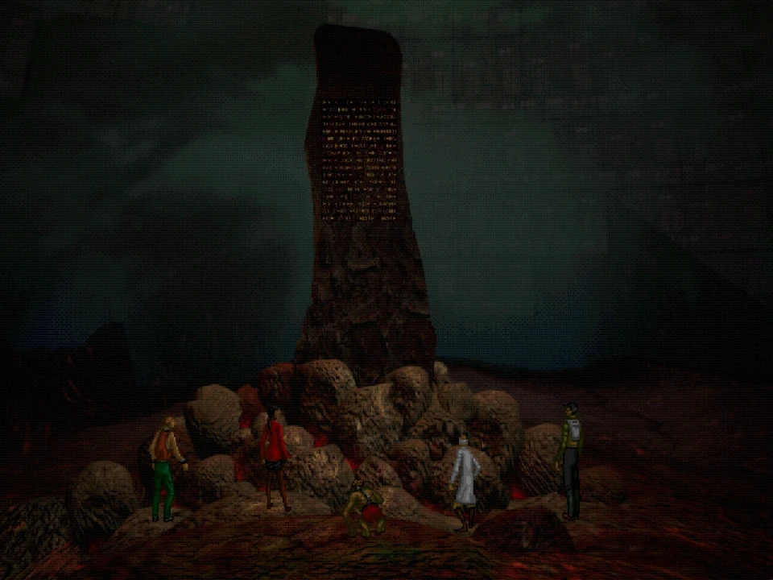

# Design prostředí

## Levely

### 1. Les
- **Popis prostředí**: Hustý, temný les plný zamlžených stromů, kde slyšíme šepot a vzdálené kroky. Půda je blátivá a kluzká, zvuky praskání větví a šeptání se odráží kolem -> vyvolávání pocitů úzkosti a pronáslednování.
- **Symbolika**: Les reprezentuje Tedovu osamělost a zmatek, kde hledá kontakt, ale nalézá jen iluzi života a prázdn otu.
- **Herní prvky**: Ted nalézá stopy dalších postav – ohniště, rozbitý stan, staré boty – ale všechny jsou jen fragmenty iluzí. V lese se také objevují odrazy Teda samotného, což naznačuje AM-ovu kontrolu nad jeho myslí.

#### Náčrty

#### DALL-E:

### 2. Pustina
- **Popis prostředí**: Rozlehlá, šedá a pustá krajina bez stromů a hor. Na obzoru jsou sotva viditelné rozpadající se konstrukce. Teda vedou cestou lampy, které jako jediné prosvítají skrz mlhu. Všude je vítr, který přináší skřípající zvuky a šepot, zesilující Tedovy halucinace -> *fata morgana*. Na konci lokace se uprostřed ničeho zjeví hořící keř a z vypravěče se stává AM -> Vypravěčem je nyní Ted, který si je nyní vědom všeho co se stalo do tohoto bodu a své existence.
- **Symbolika**: Pustina symbolizuje beznaděj a podvědomou bezvýchodnost. Ukazuje na AM-ovo zničení světa i neexistenci jakékoliv skutečné budoucnosti.
- **Herní prvky**: Hráč může vidět přízraky ostatních postav v dálce, jež však při přiblížení mizí. Na zemi jsou kousky deníků, poznámek a stop, které zesilují Tedovu touhu po společnosti, ale zároveň odhalují absurditu tohoto snažení.

#### Náčrty

#### DALL-E:

### 3. Budova
- **Popis prostředí**: Rozpadlá budova, která dříve vypadala jako azyl nebo útočiště (Ted se do ní jde ukrýt před sebou po konfrontaci s AM). Kolem se nachází místnosti s popraskanými zdmi, prázdné rámce oken a roztrhané záclony. Stínová silueta AM-u jako „hořícího keře“ je občas viditelná na zdech.
- **Symbolika**: Budova reprezentuje falešný úkryt a AM-ovu kontrolu nad vším, co Ted najde. Je to prostor, který by měl poskytovat bezpečí, ale místo toho ukrývá AM-ovy manipulace. Ted si prochází svojí minulostí nekonečného mučení strojem.
- **Herní prvky**: Hráč nalézá klíčové předměty, jako je jídlo či nástroje, ale při jejich použití vždy zjistí, že jsou nefunkční nebo umělé. Zvuky a šeptání AM-u nutí Teda ztratit orientaci, jak AM postupně přebírá kontrolu nad vědomým Teda.

#### Náčrty

#### DALL-E:

### 4. Znetvoření
- **Popis prostředí**: Temný prostor, kde se podlaha a stěny zdají být z černého zrcadla. V prostoru se vznáší křišťálové zrcadlo ukazující různé verze Tedova vlastního odrazu, který se deformuje a mění.
- **Symbolika**: Tato komnata představuje AM-ovu plnou moc nad Tedovou identitou, psychikou i fyzickou formou. Jde o místo, kde Ted čelí pravdě, že je pod kompletní kontrolou AM-a.
- **Herní prvky**: Ted vidí odrazy sám sebe jako pokřivené formy, různé verze sebe sama, což jej přivádí k zoufalství. AM mu v této chvíli nabízí „svobodu“ ve formě ostrého střepu, jen aby ho nakonec transformoval do beztvaré masy, uvězněné v jeho moci.

#### Náčrty

#### DALL-E:

### 5. Pilíř Nenávisti (Závěrečná scéna)
- **Popis prostředí**: Ted je uvězněn u pilíře, kolem kterého krouží fragmenty jeho minulého života a utrpení ostatních přeživších. AM hovoří přímo, symbolicky projevující svou zášť, nenávist a kontrolu nad Tedem. Symboly, že Ted není jediný přeživší.
- **Symbolika**: Pilíř zosobňuje AM-ovu nenávist lidství a věčnost jeho kontroly. Zde Ted pochopí, že je odsouzený k věčnému utrpení, zatímco AM pokračuje ve své tyranii.
- **Herní prvky**: AM vede závěrečný monolog o lidské slabosti a svém utrpení, které si vybíjí na přeživších. Ted je neschopen pohybu a vidí záblesk své budoucnosti, kde je proměněn do podoby beztvaré masy, symbolicky završující AM-ovu „pomstu“.

#### Náčrty

#### DALL-E:

#### Originální hra:
